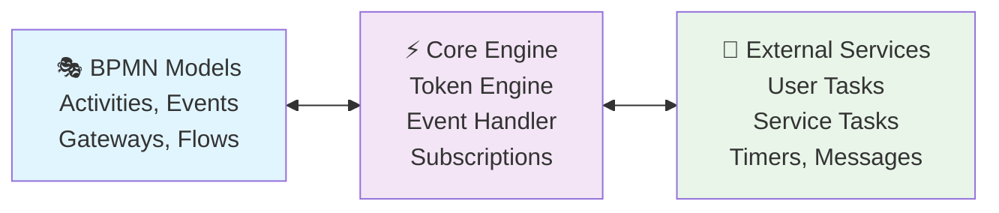

<div align="center">

# 🚀 Flowzer BPMN Core Engine

**Eine moderne, vollständig BPMN 2.0 konforme Ausführungsengine für Business Process Workflows**

[](https://dotnet.microsoft.com/)
[](https://www.omg.org/spec/BPMN/2.0/)
[](LICENSE)
[](https://github.com/flowzer-io/flowzer-bpmn-core-engine)

*Entwickelt mit C# .NET 8 für maximale Performance, Skalierbarkeit und moderne Entwicklungspatterns*

</div>

---

## 🎯 Übersicht

Das **flowzer-bpmn-core-engine** ist eine leistungsstarke, event-driven BPMN 2.0 Execution Engine, die eine vollständige Implementierung der OMG BPMN-Spezifikation für .NET Anwendungen bereitstellt. Die Engine kombiniert moderne C# Features mit bewährten Architekturprinzipien für höchste Zuverlässigkeit und Erweiterbarkeit.

### 🏗️ Kernkomponenten

| Komponente | Beschreibung | Technologie |
|------------|--------------|-------------|
| **🎭 BPMN Models** | Vollständige BPMN 2.0 Element-Modellierung mit Type Safety | C# 12, Nullable Reference Types |
| **⚡ Core Engine** | Event-driven Ausführungsengine mit Token-basierter Steuerung | Async/Await, Task-based APIs |
| **🔌 Service Integration** | Pluggable Architecture für externe System-Integration | Dependency Injection, Interface-based Design |
| **🌐 Web API** | RESTful API für Prozessmanagement und -überwachung | ASP.NET Core 8 |
| **💻 Frontend** | Moderne Web-Oberfläche für Prozessvisualisierung | Blazor Server |

## 🏛️ Architektur

<div align="center">



</div>

### 🔄 Execution Flow

1. **📥 Process Loading**: BPMN XML wird geparst und in typisierte .NET Objekte konvertiert
2. **🎯 Token Management**: Token repräsentieren den aktuellen Ausführungsstand im Prozess
3. **📡 Event Handling**: Asynchrone Verarbeitung von externen Events und Interaktionen
4. **🔗 Service Integration**: Nahtlose Integration mit externen Systemen über definierte Interfaces

## ✨ Features

<div align="center">

| Feature | Status | Beschreibung |
|---------|--------|--------------|
| 🎯 **BPMN 2.0 Compliance** | ✅ | Vollständige Implementierung der OMG BPMN 2.0 Spezifikation |
| ⚡ **Event-Driven Architecture** | ✅ | Asynchrone, event-basierte Prozessausführung mit hoher Performance |
| 🎫 **Token-Based Execution** | ✅ | Präzise Verfolgung und Steuerung des Prozess-Ausführungsstands |
| 🔌 **Plugin Architecture** | ✅ | Erweiterbare Architektur für Custom Activities und Services |
| 🚀 **Modern C#** | ✅ | .NET 8, Nullable Reference Types, Primary Constructors, Async/Await |
| 🏗️ **Clean Architecture** | ✅ | Klare Trennung von BPMN-Model und Execution Logic |
| 🔒 **Type Safety** | ✅ | Vollständig typisierte BPMN-Elemente mit Compile-Time Checks |
| 📊 **Process Monitoring** | ✅ | Umfassende APIs für Prozess-Überwachung und -Steuerung |

</div>

## 🧩 Unterstützte BPMN-Elemente

<details>
<summary><strong>📋 Activities (Click to expand)</strong></summary>

- ✅ **Task**: Grundlegende Arbeitsschritte
- ✅ **User Task**: Benutzerinteraktionen mit Form-Integration
- ✅ **Service Task**: Automatisierte Service-Aufrufe
- ✅ **Script Task**: Inline-Skriptausführung
- ✅ **Send Task**: Nachrichten an externe Systeme
- ✅ **Receive Task**: Warten auf externe Nachrichten
- ✅ **Business Rule Task**: Regel-Engine Integration
- ✅ **Sub Process**: Verschachtelte Prozesse
- ✅ **Call Activity**: Wiederverwendbare Prozessmodule
- ✅ **Ad-hoc Sub Process**: Flexible, benutzergesteuerte Prozesse
- ✅ **Transaction**: ACID-konforme Transaktionsblöcke

</details>

<details>
<summary><strong>⚡ Events (Click to expand)</strong></summary>

- ✅ **Start Events**: Prozessinitiation
- ✅ **End Events**: Prozessbeendigung
- ✅ **Intermediate Events**: Prozess-Unterbrechungen
- ✅ **Timer Events**: Zeitbasierte Trigger
- ✅ **Message Events**: Inter-System Kommunikation
- ✅ **Signal Events**: Broadcast-Nachrichten
- ✅ **Error Events**: Fehlerbehandlung
- ✅ **Escalation Events**: Eskalationsmanagement
- ✅ **Boundary Events**: Element-gebundene Events
- ✅ **Compensation Events**: Kompensations-Logik

</details>

<details>
<summary><strong>🚦 Gateways (Click to expand)</strong></summary>

- ✅ **Exclusive Gateway**: XOR-Entscheidungen
- ✅ **Parallel Gateway**: AND-Parallelisierung
- ✅ **Inclusive Gateway**: OR-Entscheidungen
- ✅ **Complex Gateway**: Komplexe Routing-Logik
- ✅ **Event-based Gateway**: Event-gesteuerte Entscheidungen

</details>

<details>
<summary><strong>💾 Data Elements (Click to expand)</strong></summary>

- ✅ **Data Objects**: Prozessdaten-Modellierung
- ✅ **Data Stores**: Persistente Datenspeicher
- ✅ **Properties**: Element-spezifische Eigenschaften
- ✅ **Data Input/Output**: Schnittstellen-Definition
- ✅ **Item Definitions**: Datentyp-Definitionen

</details>

## 🚀 Schnellstart

### 📋 Voraussetzungen

- [.NET 8.0 SDK](https://dotnet.microsoft.com/download/dotnet/8.0) oder höher
- Eine IDE Ihrer Wahl ([Visual Studio](https://visualstudio.microsoft.com/), [JetBrains Rider](https://www.jetbrains.com/rider/), [VS Code](https://code.visualstudio.com/))
- Optional: [Git](https://git-scm.com/) für die Versionskontrolle

### 📦 Installation

```bash
# Repository klonen
git clone https://github.com/flowzer-io/flowzer-bpmn-core-engine.git
cd flowzer-bpmn-core-engine

# Dependencies wiederherstellen
dotnet restore

# Projekt kompilieren
dotnet build

# Tests ausführen (optional)
dotnet test
```

### 💡 Erste Schritte

Hier ist ein einfaches Beispiel, wie Sie die Engine verwenden können:

```csharp
using core_engine;
using System;
using System.IO;

// 1. 🎯 Engine initialisieren
var engine = new CoreEngine();

// 2. 📄 BPMN-Prozess laden
using var xmlStream = File.OpenRead("my-process.bpmn");
await engine.LoadBpmnFile(xmlStream, verify: true);

// 3. 🎬 Prozess starten
var instanceId = Guid.NewGuid();
var startEvent = new EventData 
{ 
    BpmnNodeId = "StartEvent_1", 
    InstanceId = instanceId 
};

var result = await engine.HandleEvent(new Instance(), startEvent);
Console.WriteLine($"✅ Prozess gestartet! Aktive Interaktionen: {result.Interactions?.Count}");
```

### 🎭 Vollständiges Beispiel

Ein umfassendes Beispiel finden Sie unter [`examples/SimpleEngineExample.cs`](examples/SimpleEngineExample.cs), das einen kompletten Approval-Workflow demonstriert.

## 🔧 Entwicklung

### 📚 Umfassende Entwicklungsrichtlinien

Für detaillierte Entwicklungsrichtlinien, Code-Standards und Best Practices siehe:
- 📖 [**DEVELOPMENT-GUIDELINES.md**](DEVELOPMENT-GUIDELINES.md) - Vollständige Entwicklungsrichtlinien
- 🤖 [**GitHub Copilot Instructions**](.github/copilot-instructions.md) - Optimierte Copilot-Unterstützung

### 🎯 Grundprinzipien

<table>
<tr>
<td width="50%">

**🎯 BPMN 2.0 Standard Compliance**
- Strikte Einhaltung der OMG BPMN 2.0 Spezifikation
- Vollständige XML Schema-Kompatibilität
- Standard-konforme Namensgebung

**🏗️ Clean Architecture**
- Klare Trennung zwischen BPMN-Modell und Engine
- Interface-basiertes Design (`ICore`, `IBaseElement`)
- Dependency Injection für maximale Testbarkeit

</td>
<td width="50%">

**⚡ Event-Driven Design**
- Asynchrone, event-basierte Ausführung
- Token-basierte Prozesssteuerung
- Subscription-basierte Service-Integration

**🚀 Modern C# Features**
- .NET 8 mit neuesten Language Features
- Nullable Reference Types für Type Safety
- Primary Constructors und moderne Syntax

</td>
</tr>
</table>

### 🛠️ Entwicklungstools Setup

```bash
# Entwicklungsumgebung mit Überwachung starten
dotnet watch --project src/WebApiEngine

# Frontend entwickeln (Blazor)
dotnet watch --project src/FlowzerFrontend

# Tests mit Coverage ausführen
dotnet test --collect:"XPlat Code Coverage"
```

### 🧪 Testing-Strategie

```csharp
// Beispiel für BPMN-Prozess Test
[Test]
public async Task ProcessExecution_WithUserTask_ShouldCreateCorrectSubscription()
{
    // Arrange: BPMN-Definition laden
    var engine = new CoreEngine();
    await engine.LoadBpmnFile(GetTestBpmnStream(), verify: true);
    
    // Act: Prozess starten
    var result = await engine.HandleEvent(testInstance, startEvent);
    
    // Assert: Erwartete Subscriptions und Tokens
    Assert.That(result.Interactions, Has.Count.EqualTo(1));
    Assert.That(result.Interactions[0], Is.TypeOf<UserTask>());
}
```

## 🤝 Beiträge & Community

### 🎉 Beiträge sind willkommen!

Wir freuen uns über Beiträge aller Art! Bevor Sie loslegen, lesen Sie bitte:

- 📋 [**Entwicklungsrichtlinien**](DEVELOPMENT-GUIDELINES.md) für technische Standards
- 🤖 [**Copilot Instructions**](.github/copilot-instructions.md) für konsistente Code-Qualität
- 🔄 **Pull Request Template** für strukturierte Beiträge

### 🐛 Issues & Feature Requests

- 🐞 **Bug Reports**: Nutzen Sie GitHub Issues mit dem `bug` Label
- ✨ **Feature Requests**: Schlagen Sie neue Features mit dem `enhancement` Label vor
- 📚 **Documentation**: Verbesserungen der Dokumentation sind immer willkommen
- 💬 **Discussions**: Nutzen Sie GitHub Discussions für allgemeine Fragen

### 👥 Community Guidelines

1. **🤝 Respektvoller Umgang**: Behandeln Sie alle Community-Mitglieder respektvoll
2. **📖 Dokumentation**: Code-Änderungen sollten entsprechend dokumentiert werden
3. **🧪 Tests**: Neue Features benötigen entsprechende Tests
4. **🎯 BPMN Compliance**: Alle Änderungen müssen BPMN 2.0 konform sein

---

## 📄 Lizenz

Dieses Projekt steht unter der [**Mozilla Public License 2.0**](LICENSE).

```
Copyright (c) 2024 Flowzer.io
Licensed under MPL-2.0
```

---

## 🔗 Links & Ressourcen

### 📚 Dokumentation
- [BPMN 2.0 Specification](https://www.omg.org/spec/BPMN/2.0/) - Offizielle OMG BPMN Spezifikation
- [.NET 8 Documentation](https://docs.microsoft.com/en-us/dotnet/core/) - Microsoft .NET Dokumentation

### 🛠️ Tools & Integration
- [bpmn.io](https://bpmn.io/) - BPMN-Modellierungs-Tools
- [forms.io](https://www.form.io/) - Form-Engine für User Tasks

### 🏢 Über Flowzer.io
- [Website](https://flowzer.io) - Hauptwebsite
- [GitHub](https://github.com/flowzer-io) - Weitere Open Source Projekte

---

<div align="center">

**⭐ Wenn Ihnen dieses Projekt gefällt, geben Sie uns einen Star auf GitHub! ⭐**

*Entwickelt mit ❤️ von der Flowzer.io Community*

</div>
